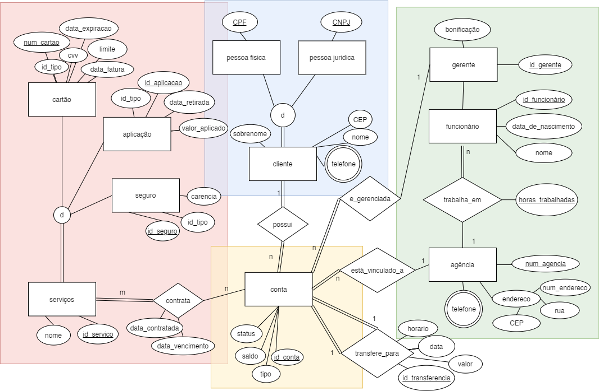

# bank-relational-database
## 1. Descrição
O presente trabalho é a representação de um banco de dados de uma agência bancária. No modelo criado pelo grupo, cada funcionário trabalha em uma agência e os funcionários que são gerentes recebem uma bonificação. Sempre que um funcionário é inserido no banco de dados, ele recebe um ID, usado para identificá-lo internamente na agência. Além disso, é feito o registro tanto da data de nascimento quanto do nome de cada funcionário. Também é feito o registro da carga horária de cada funcionário na agência em que trabalha. Os dados da agência requeridos são: telefone e endereço; sendo esse último dividido em: número, rua e cep. 

Em relação aos clientes, ou são uma pessoa jurídica (identificada pelo CNPJ) ou uma pessoa física (identificada pelo CPF). Todo cliente possui registro de nome e de telefone e possui uma conta. Além disso, quando o cliente é inserido no banco de dados, recebe um ID, que é usado para identificá-lo internamente na agência. Os dados da conta registrados são: tipo (corrente ou poupança), saldo, status, número da agência que está vinculada e ID do gerente responsável.   

Por meio da conta, podemos fazer duas ações: transferência e contratar um serviço. Ao fazer uma transferência, o banco registra o valor, data, horário, número da conta do remetente e número da conta do destinatário (ambas devem ser contas registradas no banco de dados). Ao contratar um serviço, é registrada tanto a data em que ele foi contratado quanto a de vencimento. As opções do cliente ao contratar um serviço são: seguro, aplicação e cartão. No primeiro caso, são registrados o nome do seguro, o tipo e a carência. Já no segundo caso, são registrados o valor aplicado e a data de retirada. Por fim, ao solicitar um cartão, são registrados: a data de vencimento da fatura, o limite, o tipo, o número do cartão e o CVV.

## 2. Diagrama ER

## 3. Esquema Relacional
### 3.1 Resumo
#### • Serviços:
Serviços(id_servico, num_cartao, id_aplicacao, id_seguro, id_conta, nome, data_contratada,  data_vencimento)   
Cartão(num_cartao, id_tipo, limite, fatura, data_fatura, data_expiracao, cvv)   
Aplicação(id_aplicacao, id_tipo, valor_aplicado, data_retirada)  
Seguro(id_seguro, id_tipo, carencia)  
TipoServiço(id_tipo, nome)  
#### • Conta:
Conta(id_conta, CPF, CNPJ, num_agência, id_gerente, saldo)  
Cliente(CPF, CNPJ, nome, sobrenome, cep, rua, num_endereco, cidade, estado, renda)  
Telefone(CPF, CNPJ, num_agência, telefone)  
Transfere_para(id_transferencia, id_remetente, id_destino, valor, data, horario)  
#### • Agencia:
Agência(num_agencia, CEP, rua, num_endereco)  
Funcionario(id_funcionario, data_nascimento, nome, bonificacao, num_agencia, horas_trabalhadas)  
## 4. Implementação
### 4.1 [Tabelas](./database.py)
#### • Serviços:
    CREATE TABLE IF NOT EXISTS servico (
        id_servico integer PRIMARY KEY AUTOINCREMENT,
        num_cartao integer,
        id_aplicacao integer,
        id_seguro integer,
        id_conta integer NOT NULL,
        nome text NOT NULL,
        data_contratada text NOT NULL,
        data_vencimento text,
        FOREIGN KEY(num_cartao) REFERENCES cartao(num_cartao) ON DELETE CASCADE,
        FOREIGN KEY(id_aplicacao) REFERENCES aplicacao(id_aplicacao) ON DELETE CASCADE,
        FOREIGN KEY(id_seguro) REFERENCES seguro(id_seguro) ON DELETE CASCADE,
        FOREIGN KEY(id_conta) REFERENCES conta(id_conta) ON DELETE CASCADE
        );

    CREATE TABLE IF NOT EXISTS cartao (
        num_cartao integer PRIMARY KEY CHECK (length(num_cartao) = 16),
        id_tipo integer NOT NULL,
        limite integer,
        fatura integer,
        data_fatura text,
        data_expiracao text,
        cvv integer NOT NULL,
        FOREIGN KEY(id_tipo) REFERENCES tipo_servico(id_tipo) ON DELETE RESTRICT
        );

    CREATE TABLE IF NOT EXISTS aplicacao (
        id_aplicacao integer PRIMARY KEY AUTOINCREMENT,
        id_tipo integer NOT NULL,
        valor_aplicado integer NOT NULL,
        data_retirada text,
        FOREIGN KEY(id_tipo) REFERENCES tipo_servico(id_tipo) ON DELETE RESTRICT
        );

    CREATE TABLE IF NOT EXISTS seguro (
        id_seguro integer PRIMARY KEY AUTOINCREMENT,
        id_tipo integer NOT NULL,
        carencia integer,
        FOREIGN KEY(id_tipo) REFERENCES tipo_servico(id_tipo) ON DELETE RESTRICT
        );

    CREATE TABLE IF NOT EXISTS tipo_servico (
        id_tipo integer PRIMARY KEY AUTOINCREMENT,
        nome text NOT NULL
        );
#### • Contas:
    CREATE TABLE IF NOT EXISTS conta (
        id_conta integer PRIMARY KEY AUTOINCREMENT,
        CPF text,
        CNPJ text,
        num_agencia integer NOT NULL,
        id_gerente integer NOT NULL,
        saldo integer NOT NULL,
        FOREIGN KEY(CPF, CNPJ) REFERENCES cliente(CPF, CNPJ) ON DELETE CASCADE, 
        FOREIGN KEY(num_agencia) REFERENCES agencia(num_agencia) ON DELETE RESTRICT,
        FOREIGN KEY(id_gerente) REFERENCES funcionario(id_funcionario) ON DELETE RESTRICT
        );

    CREATE TABLE IF NOT EXISTS cliente (
        CPF text,
        CNPJ text,
        nome text NOT NULL,
        sobrenome text NOT NULL,
        CEP integer NOT NULL,
        rua text,
        num_endereco integer,
        cidade text NOT NULL,
        estado text NOT NULL,
        renda integer NOT NULL,
        PRIMARY KEY(CPF, CNPJ)
        );

    CREATE TABLE IF NOT EXISTS telefone (
        CPF text,
        CNPJ text,
        num_agencia integer,
        telefone text NOT NULL CHECK (length(telefone) >= 11),
        PRIMARY KEY(CPF, CNPJ, num_agencia, telefone),
        FOREIGN KEY(CPF, CNPJ) REFERENCES cliente(CPF, CNPJ) ON DELETE CASCADE,
        FOREIGN KEY(num_agencia) REFERENCES agencia(num_agencia) ON DELETE CASCADE
        );

    CREATE TABLE IF NOT EXISTS transfere_para (
        id_transferencia integer PRIMARY KEY AUTOINCREMENT,
        id_remetente integer NOT NULL,
        id_destino integer NOT NULL,
        valor integer NOT NULL,
        data text NOT NULL,
        horario text,
        FOREIGN KEY(id_remetente) REFERENCES conta(id_conta) ON DELETE RESTRICT,
        FOREIGN KEY(id_destino) REFERENCES conta(id_conta) ON DELETE RESTRICT
        );
#### • Agência:
    CREATE TABLE IF NOT EXISTS agencia (
        num_agencia integer PRIMARY KEY,
        CEP integer NOT NULL,
        rua text,
        num_endereco integer
        );

    CREATE TABLE IF NOT EXISTS funcionario (
        id_funcionario integer PRIMARY KEY AUTOINCREMENT,
        data_de_nascimento text NOT NULL,
        nome text NOT NULL,
        bonificacao integer,
        num_agencia integer NOT NULL,
        horas_trabalhadas integer NOT NULL,
        FOREIGN KEY(num_agencia) REFERENCES agencia(num_agencia) ON DELETE RESTRICT
        );
### 4.2 Assertions
#### O saldo não pode ser negativo
    CREATE ASSERTION saldo_nao_nulo (
        CHECK(NOT EXISTS ( SELECT * FROM conta WHERE saldo<0))
    );
#### A fatura não pode exceder o limite
    CREATE ASSERTION fatura_dentro_do_limite (
     CHECK(NOT EXISTS (SELECT * FROM cartao WHERE fatura > limite))
    );   
#### A fatura não pode ser negativa
    CREATE ASSERTION fatura_nao_pode_ser_negativa (
        CHECK(NOT EXISTS (SELECT * FROM cartao WHERE fatura < 0))
    );
#### CPF e CNPJ não podem ter ambos valores válidos
    CREATE ASSERTION cpf_cnpj_nao_podem_ser_nulos_simultaneamente_cliente (
        CHECK(NOT EXISTS (SELECT * FROM cliente WHERE CPF=NULL AND CNPJ=NULL))
    );

    CREATE ASSERTION cpf_cnpj_nao_podem_ser_nulos_simultaneamente_conta (
        CHECK(NOT EXISTS (SELECT * FROM conta WHERE CPF=NULL AND CNPJ=NULL))
    );

    CREATE ASSERTION cpf_cnpj_nao_podem_ser_nulos_simultaneamente_telefone (
        CHECK(NOT EXISTS(SELECT * FROM telefone WHERE CPF=NULL AND CNPJ=NULL))
    );

    CREATE ASSERTION cpf_e_cnpj_nao_podem_validos_simultaneamente_cliente (
        CHECK(NOT EXISTS (SELECT * FROM cliente WHERE CPF!=NULL AND CNPJ!=NULL))
    );

    CREATE ASSERTION cpf_e_cnpj_nao_podem_validos_simultaneamente_conta (
        CHECK(NOT EXISTS (SELECT * FROM conta WHERE CPF!=NULL AND CNPJ!=NULL))
    );

    CREATE ASSERTION cpf_e_cnpj_nao_podem_validos_simultaneamente_telefone (
        CHECK(NOT EXISTS (SELECT * FROM telefone WHERE CPF!=NULL AND CNPJ!=NULL))
    );
#### Serviço só pode ser de um tipo
    CREATE ASSERTION servico_so_pode_ser_de_um_tipo (
        CHECK(NOT EXISTS (SELECT * FROM servico WHERE NOT IN (
        SELECT * FROM servico WHERE num_cartao!=NULL AND id_aplicacao=NULL AND id_seguro=NULL) FULL OUTER JOIN
        SELECT * FROM servico WHERE num_cartao=NULL AND id_aplicacao!=NULL AND id_seguro=NULL
        FULL OUTER JOIN
        SELECT * FROM servico WHERE num_cartao=NULL AND id_aplicacao=NULL AND id_seguro!=NULL))
    );
